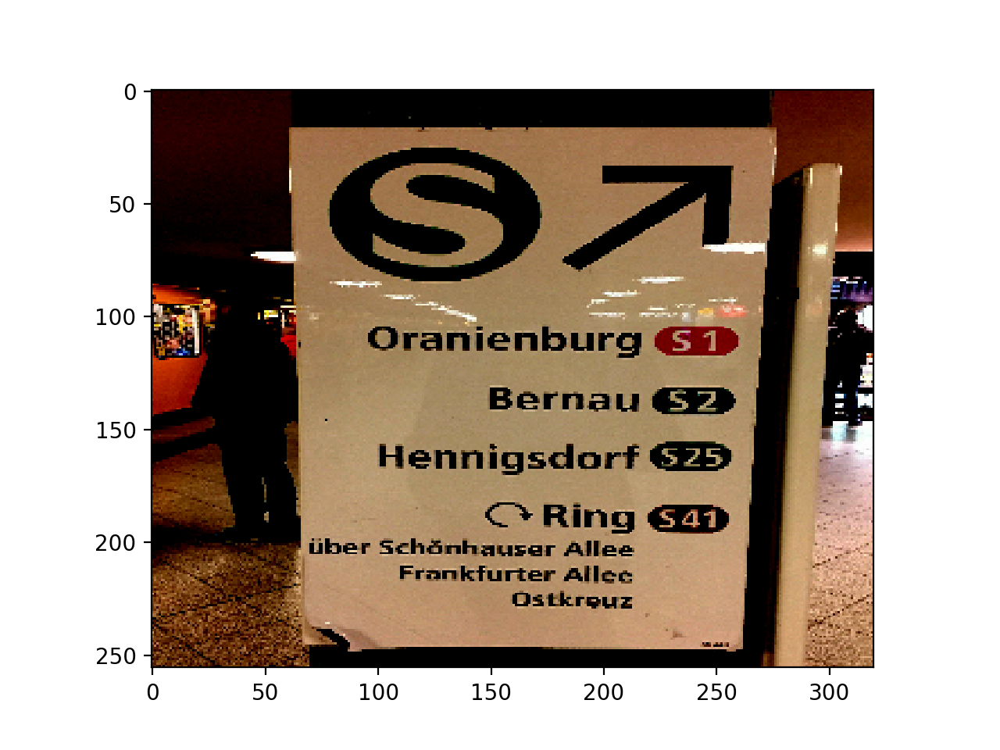
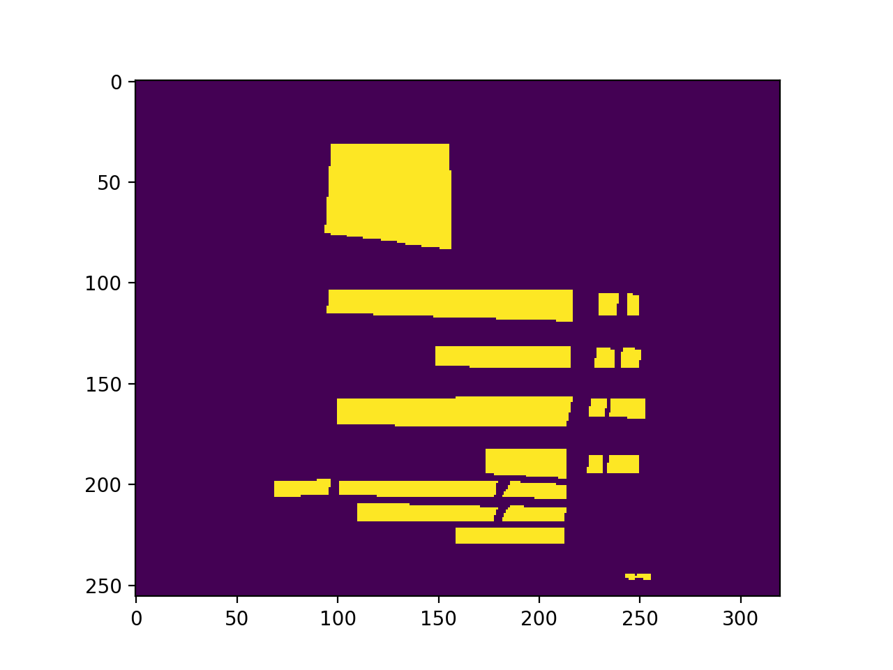

# Training with `tf.estimator` and `tf.keras` yields inconsistent results

## Input

## Label

## Overfitting on a single image for 300 epochs with pure `tf.keras`

## Overfitting on a single image for 300 epochs with the `tf.keras` model converted to `tf.estimator.Estimator`

## Overfitting on a single image for 300 epochs with the raw `tf.keras` model in the `tf.estimator` model function 

